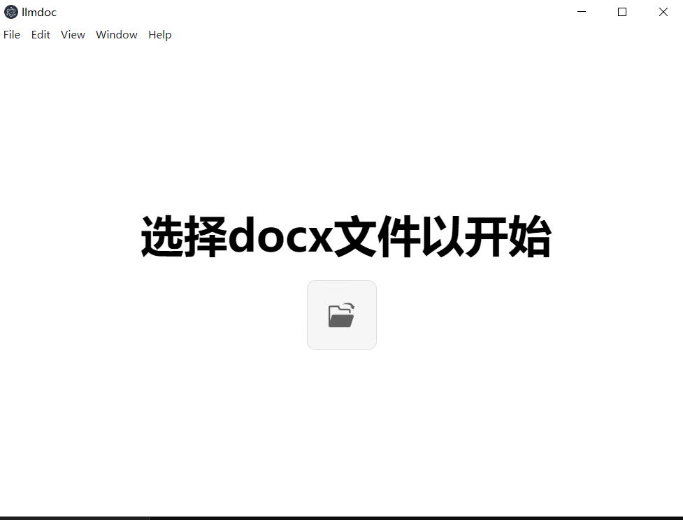
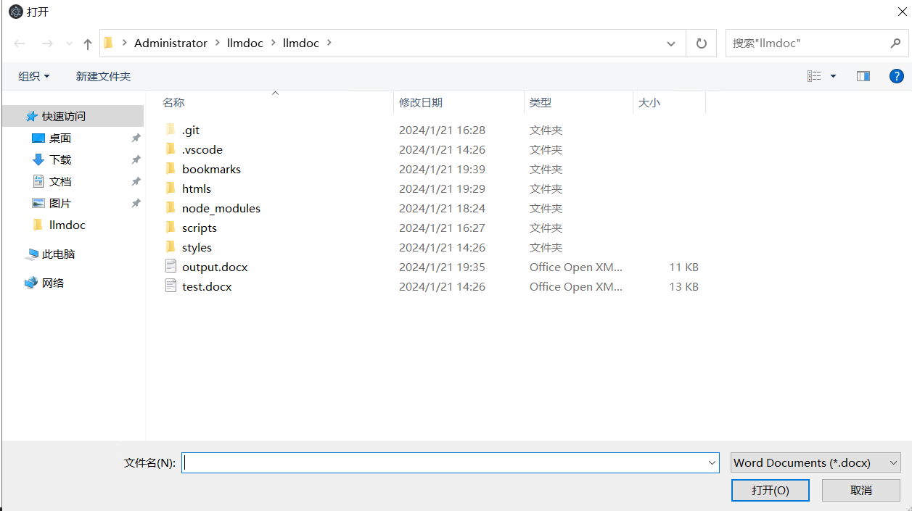
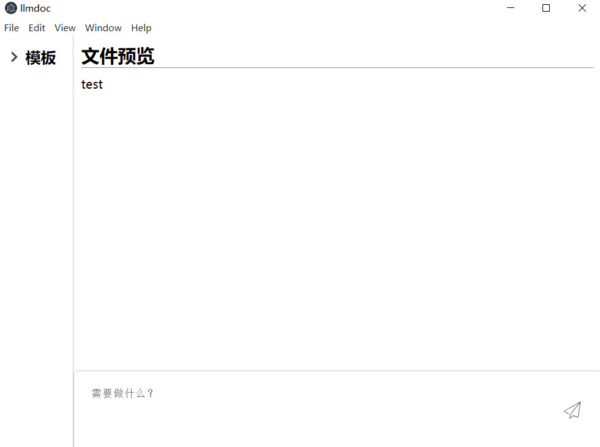
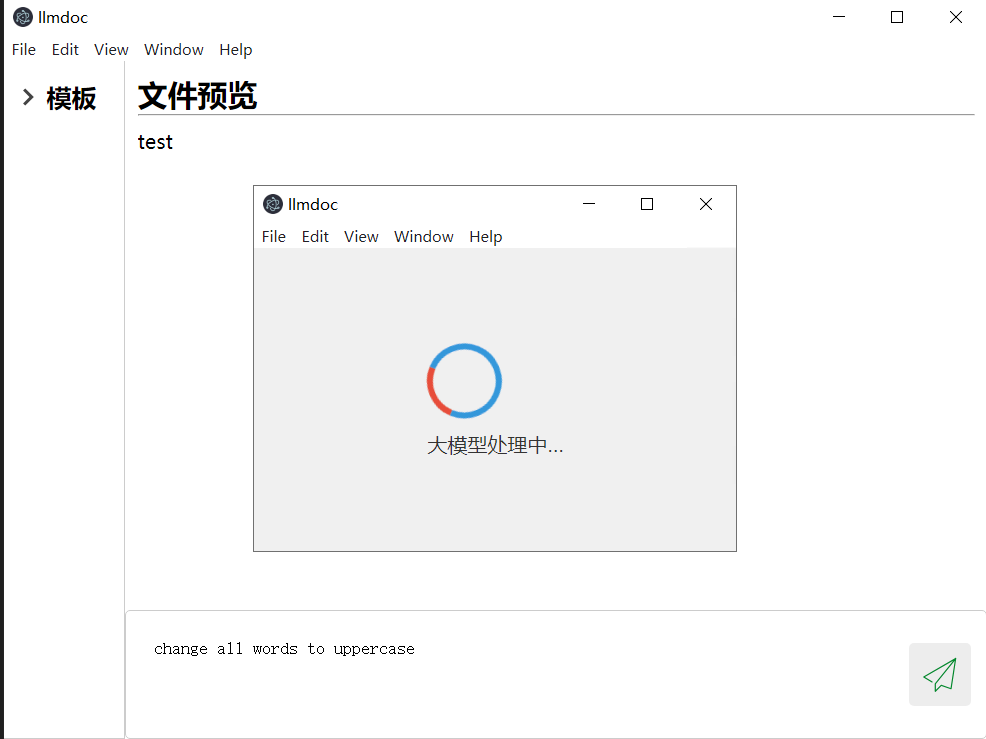
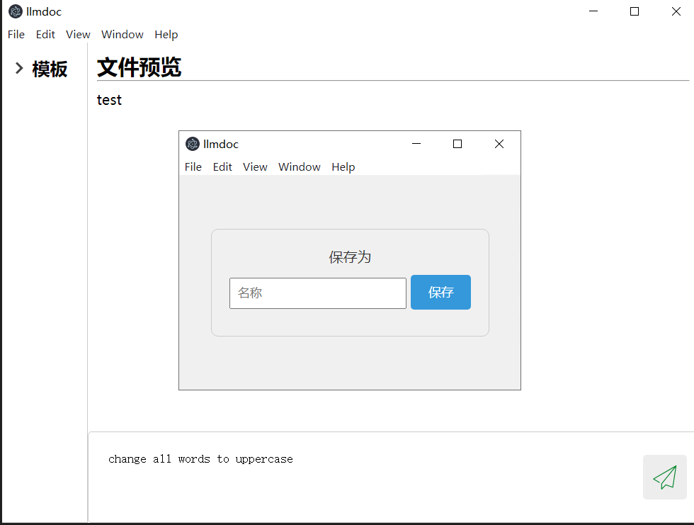
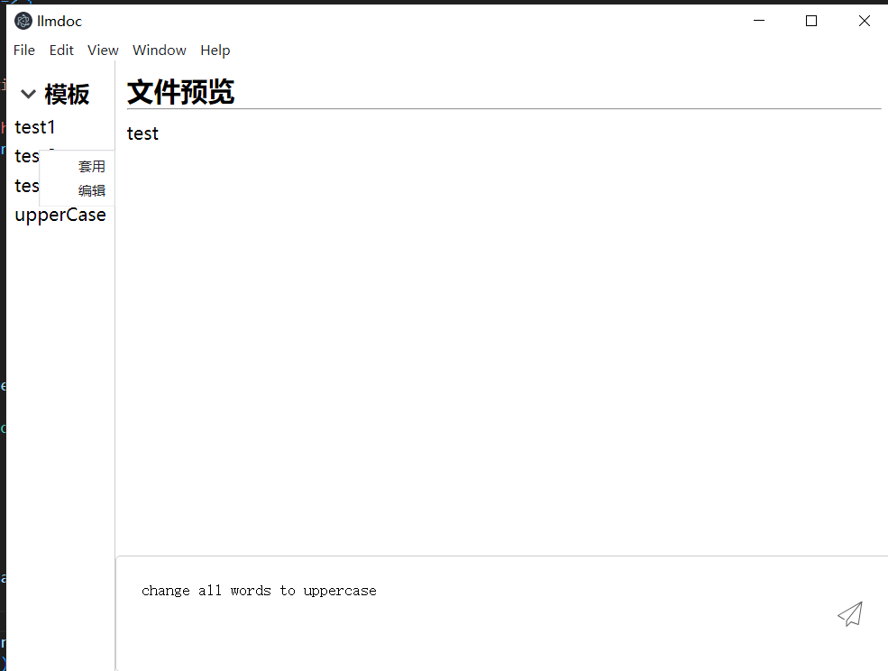
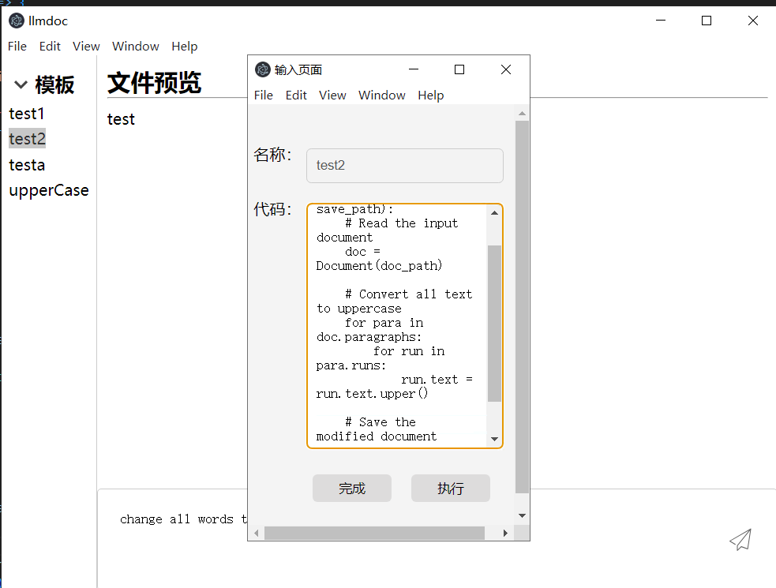

# llmdoc-基于大模型的办公自动化应用

- 学号：10215501411
- 姓名：吴冕志

- Github地址：[Hdksg10/llmdoc at master (github.com)](https://github.com/Hdksg10/llmdoc/tree/master)

- B站演示视频：【[llmdoc] 云计算期末作业演示】 https://www.bilibili.com/video/BV1F64y1P7zk/
## 安装与运行

由于时间有限，我没有成功将应用程序打包成可执行文件进行分发，不过可以从源码运行应用。

安装node.js环境：

```
cnpm install --save-dev electron
npm install mammoth
```

安装python环境（推荐conda）

```
pip install bigdl-llm[all] # install bigdl-llm with 'all' option
pip install tiktoken einops transformers_stream_generator  # additional package required for Qwen-7B-Chat to conduct generation
pip install python-docx
```

从huggingface.co（或其它镜像站）下载需要的llm，例如

[Qwen/Qwen-7B-Chat · Hugging Face](https://huggingface.co/Qwen/Qwen-7B-Chat)

设置配置文件`config.json`

```
{
    "pythonPath": "C:/ProgramData/anaconda3/envs/llm/python.exe", // 需要安装python-docx
    "llmPath": "C:/ProgramData/anaconda3/envs/llm/python.exe", // 能够运行对应的llm推理脚本
    "modelPath": "C:/Users/Administrator/Downloads/qwen7b-chat"
}
```

在上传的代码中，仍然需要手动更改程序使用的llm的位置

```python
#./scripts/llm.py
QWEN_PROMPT_FORMAT = """
    <|im_start|>system
    You are a helpful assistant.
    <|im_end|>
    <|im_start|>user
    {prompt}
    <|im_end|>
    <|im_start|>assistant
"""

if __name__ == '__main__':
    parser = argparse.ArgumentParser(description='Predict Tokens using `generate()` API for Qwen model')
    parser.add_argument('--repo-id-or-model-path', type=str, default="C:/Users/Administrator/Downloads/qwen7b-chat", #修改这里为llm的目录，需要保证是huggingface的标准形式
                        help='The huggingface repo id for the Qwen model to be downloaded'
                             ', or the path to the huggingface checkpoint folder')
    parser.add_argument('prompt', type=str, default="AI是什么？",
                        help='Prompt to infer')
    parser.add_argument('--n-predict', type=int, default=1024,
                        help='Max tokens to predict')

    args = parser.parse_args()
    model_path = args.repo_id_or_model_path
```

在完成了上述的步骤之后，就可以运行应用程序了

```
npm start run
```

注：理论上来说应用程序只能在Windows环境下运行，另外，使用qwen-7b-chat模型（应用程序默认）推荐的设备内存为24G以上，否则可能会出现机器内存不足的情况，导致运行速度显著下降。

测试用的机器配置为：

```
CPU: Intel(R) Xeon(R) Platinum 8372HC CPU @ 3.40GHz 
内存：32G
```

## 背景与功能简介

在日常工作中，我们经常需要处理docx格式的文档，其中难免遇到繁杂的任务，因此相关的办公自动化应用可以帮助我们极大提升工作的效率。随着LLM的发展，许多使用相关技术进行办公自动化的应用得到了推广，例如微软原生的Copilot等。然而，受制于下面的原因，并非所有的工作环境都能使用现有的自动化应用：

- Microsoft Copilot/ OpenAI GPT4 API等成熟的服务并不对所有的国家和地区开放，同时在某些国家和地区访问相关服务的网络连接存在波动。
- 许多文档是政府部分或企业的秘密文件，通过常见的联网LLM服务，存在泄密的风险。

为了解决上述问题，我开发了llmdoc，这一本地部署的基于llm技术的办公自动化应用，它基于下面的开源项目：

- [Intel BigDL-LLM](https://github.com/intel-analytics/BigDL)：在Intel CPU/GPU上加速llm的推理任务
- [Electron.js](https://www.electronjs.org/)：开发桌面端应用程序
- [mammoth.js](https://github.com/mwilliamson/mammoth.js)：在前端渲染docx格式文档
- [python-docx](https://github.com/python-openxml/python-docx)：使用python新建，编辑docx格式文档
- [阿里通义千问](https://huggingface.co/Qwen)：开源大语言模型

通过本地部署的开源llm，对相关任务特化的prompt与Electron开发的桌面应用程序之间的合作，实现对docx格式文档的办公自动化操作。

## 实现简介

简单来说，llmdoc的实现分为关系较少的两部分，分别为用nodejs+html+css实现的桌面程序（本节简称为"前端"）与用python实现的llm推理和文档操作部分（本节简称为"后端"）。二者之间通过操作系统提供的ipc机制与文件系统进行通信。

具体地，应用的基本工作流程为：前端通过系统提供的pipe和fork/spawn机制，运行llm推理的python脚本，获取llm输出的代码片段，与代码模板组装形成完整的文档操作代码，再在新的进程中进行文档操作。

## 实现细节

### llm推理

相关代码文件`./scripts/llm.py, ./scripts/template.py`

我采用的llm模型为阿里开源的qwen-7b-chat模型，为了得到更好的输出结果，我使用的prompt为：

```python
full_prompt = """
        Here is an example Python code for manipulating docx documents:
        def replace_text(doc, old_text, new_text):
            # Iterate through each paragraph
            for p in doc.paragraphs:
                # If the text to be replaced is in this paragraph
                if old_text in p.text:
                    # Use runs to replace the content without changing the style
                    # Note: runs separate content based on style, ensure consistent style for replaced content
                    for run in p.runs:
                        if old_text in run.text:
                            run.text = run.text.replace(old_text, new_text)
        Please, based on your knowledge and the example above, write a code example for following task. In the code example you write next, the functional code should be within a 
        function named func(). The function should take parameters doc_path for the input document path and save_path for the saved document path. Make sure your example function's name is func().
        Please help me write the Python code example for the following operations on a docx document: {prompt}, and then save the document to save_path. Please respond in English, and output the code within a markdown-formatted code block.
        Make sure your example function's name is func(). Make sure your example function's name is func().
        """
```

在prompt中，我给出了docx文档的操作示例，以及其它的代码要求，这样能够发挥llm Incontext-learning的优势，得到准确率更高的输出。由于我使用的是7b参数量的模型，事实上，如果不在prompt中给出操作示例，llm生成的代码很少有能正常使用的。

在对应的prompt下，我们期望llm的输出具有下面的格式，至少功能代码具有下面的格式

````
```python
def func():
	#llm code here
```
````

所以我们可以用正则表达式来匹配生成的功能代码(`main.js#L68`)：`const functionRegex = /```python([\s\S]*?)```/;`

并将生成的代码嵌入到下面的代码模板中`(scripts/template.py)`：

```python
#llm code should be inserted here

import argparse

def main():
    parser = argparse.ArgumentParser(description='Template')
    parser.add_argument('input_docx', type=str)
    parser.add_argument('output_docx', type=str)
    args = parser.parse_args()
    print(args.input_docx)
    print(args.output_docx)
    func(args.input_docx, args.output_docx)

if __name__ == '__main__':
    main()

```

随后我们就可以在主进程中运行生成的代码完成对应的文档操作。

### 桌面程序开发

桌面应用的实现与其它基于Electron开发的应用类似，由主进程与若干窗口的渲染进程组成，只有主进程能够访问宿主机的环境，渲染进程只能通过Electron提供的ipc机制来通过主进程间接访问本地环境。在具体实现中，各窗口的渲染进程通过对应的html+css+javascript来渲染窗口，与网页前端类似。主进程中运行的代码`(main.js)`则负责与本地环境的交互，包括文件读写，运行llm推理中的python代码等。类似于Web应用中的后端。

#### 预加载脚本与ipc实现简介

在Electron中，主进程在创建窗口时，可以通过预加载脚本来暴露渲染进程与主进程交互的事件/接口，类似于Web应用中的XHR等前后端通信操作，这样就能实现渲染进程与主进程之间的ipc机制。例如，渲染进程需要关闭自身对应的窗口，则需要在预加载脚本中注册对应的事件。

```javascript
// preload_loading.js
const { contextBridge, ipcRenderer } = require('electron')
contextBridge.exposeInMainWorld('loading', {
    get_info: (callback) => ipcRenderer.on('loading-info', (_event, info) => callback(info)),
    loading_done: (callback) => ipcRenderer.on('loading-done', (_event, code) => callback(code)),
    close_window: (wid) => ipcRenderer.send('close-window', wid), // 注册渲染进程向主进程发送的事件
    save_bookmark: (bm) => ipcRenderer.invoke('save_bookmark',bm),
})
```

```javascript
// main.js
// 事件处理函数
function handleCloseWindow(_, wid) {
  console.log('close window...')
  let child = BrowserWindow.fromId(wid)
  child.close()
}

app.whenReady().then(() => {
  // load config
  ipcMain.on('close-window', handleCloseWindow); // 注册对应的监听事件

})
```

这样，在渲染进程中的窗口端js脚本中，我们就可以调用`close_window`方法来关闭自身所属窗口

```html
// loading.html            
<script>
            document.getElementById('show-content-button').addEventListener('click', function() {
                let name = document.getElementById('input-field').value;
                console.log(name);
                const response = window.loading.save_bookmark({"name": name, "code": new_code})
                response.then(()=>{
                  console.log("saved");
                  window.loading.close_window(wid);
                })
            });
            </script>
```


在整个应用中，我编写了三个预加载脚本：

- `preload.js`：主窗口
- `preload_bookmark.js`：模板编辑窗口
- `preload_loading.js`：llm生成等待与保存窗口

分别对应不同窗口的渲染进程与主进程的通信。

接下来我将简要介绍下应用的各个功能与对应的实现代码位置。

#### 主界面与docx文档预览渲染

- 窗口样式：`index.html, index.css`
- 前端脚本：`render.js`
- 预加载脚本：`preload.js`
- ipc方法：`open_file, disply_docx_content`







应用程序打开时，用户需要点击按钮在弹出的打开窗口中选择docx文件，随后应用会读取文件并在主界面中渲染预览内容，实现细节包括：

- 前端通过`window.docx.open_file()`调用主进程中对应的handle方法，通过调用`dialog.showOpenDialogSync`方法生成打开文件窗口。
- 用户选择文件后，主进程读取文件，并通过mammoth.js转换为html格式，将转换后的内容通过`windows.docx.disply_docx_content`信道传递给前端。
- 前端在窗口中渲染预览内容。

#### 调用llm推理生成代码

- 窗口样式：`index.html, index.css, loading.html`
- 前端脚本：`extract.js`
- 预加载脚本：`preload.js, preload_loading.js`
- ipc方法：`get_text, get_info, loading_done, close_window, save_bookmark`





通过在下方的输入框中输入任务信息，用户可以让应用通过llm生成完成自动化任务的代码，具体细节包括。

- 通过`get_text`方法将输入框文本传递给主进程
- 主进程创建新窗口(`loading.html`)，向新窗口的渲染进程传递必要的信息`get_info`
- 主进程同时生成子进程，在子进程中运行推理脚本，使用正则表达式匹配输出内容
- 子进程生成完毕后(通过callback保证)，调用`loading_done`通知窗口渲染进程可以结束加载动画
- 渲染窗口结束加载动画，显示保存窗口，将用户输入的文件名，生成代码等传回主进程`save_bookmark`，并要求主进程关闭保存窗口。`close_window`
- 主进程接受到对应信号后，将生成的模板保存到文件中，同时关闭保存窗口

#### 模板管理

用户可以在侧边栏中编辑或执行模板代码，右键单击或双击都可以编辑或执行。





- 窗口样式：`bookmark.html, bookmark.css, index.html, index.css`
- 前端脚本：`bookmark.js, bookmark_edit.js`
- 预加载脚本：`preload.js, preload_bookmark.js`
- ipc方法：`get_text, run_bookmark, edit_bookmark, edit-bookmark-inner, bookmark_menu, reload_all_bookmarks, load_all_bookmarks, load_bookmark `

由于这部分的实现比较繁琐，只简单介绍一些核心功能的实现。

- 运行模板：在主进程`run_bookmark`对应的handle函数中运行模板对应的代码。
- 编辑模板：在新建的模态窗口中进行修改，通过`edit-bookmark-inner`将修改后的内容写入文件中，并通知主界面重新加载模板文件`reload_all_bookmarks`。
- 页面开始时通过`load_all_bookmarks, load_bookmark`来加载文件夹中的已保存模板。
- 通过`bookmark_menu`对应的handle函数，在主进程中创建右键菜单。

## 总结与展望

尽管在演示视频中，应用程序成功完成了指定的任务，但整个应用仍存在众多的问题，包括：

- 生成代码质量较低/无法完成复杂任务：由于我们采用的是7b的模型，因此生成的代码质量无法与GPT4等参数量更大的llm相比，导致只能处理简单的任务。
- 内存占用大/配置要求高：llm对于内存的高要求使得大部分个人电脑难以运行基于本地大模型的应用。

事实上，通过采用参数量更大的模型，我们的应用程序能够完成更复杂的任务，然而这使得应用对于电脑配置的要求更为苛刻，同时也意味着用户很难在运行应用的同时完成其它工作（系统总可用内存不足）。不过，bigdl-llm推理框架还是使得大模型推理的设备要求显著降低，因为购买高显存显卡的价格显著高于购买大容量内存+先进CPU的价格，这使得部署基于大模型的应用的成本显著降低。

我认为，对于不想将信息上传到互联网上，产生泄漏风险的小型企业或组织，在工作站/高配置云服务器/服务器上部署类似于本应用程序的服务，在现有条件下是完全可行的，这给了他们信息安全与效率并存的一个解决方案。

总的来说，bigdl-llm等框架使得基于llm的生产力应用的开发成为了可行项，然而在普通的个人电脑上流畅运行此类基于本地大模型的应用仍为时尚早。
